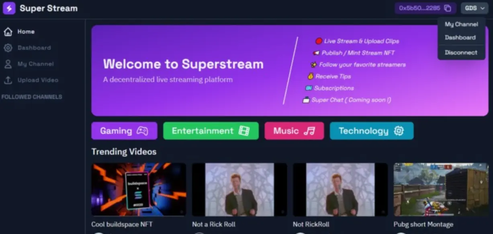

**ROSPER: 🌐 A Decentralized Platform for Influencers, Brands & Consumers**

Welcome to ROSPER! Our Web3-based platform connects influencers, brands, and consumers in a transparent, decentralized ecosystem, simplifying affiliate program management and fostering trust for all involved. 🚀




### 🌐 **Explore More**
Check out the live ROSPER platform and discover how it revolutionizes affiliate marketing in Web3!  
[🔗 **Visit ROSPER**](https://refer-one.vercel.app/)


**Why ROSPER?**  
*✨ Simplified Affiliate Management*: Say goodbye to juggling multiple affiliate programs and platforms.
*🔍 Transparency & Trust*: Clear performance metrics and payment structures to build solid brand-influencer relationships.
*💼 Effective Influencer Tracking*: Effortless tracking of influencer performance for optimized campaigns.
*🔒 Fraud Protection*: Smart solutions against affiliate fraud like click-spamming and coupon stacking.

It's like digital word-of-mouth where everyone benefits! 🌍💬

### 💡 Challenges We Tackled
1. **Complex Deployment**: Managing numerous endpoints and sensitive data made deployment tricky.
2. **Nested Smart Contracts**: Crafting these under time constraints was challenging.
3. **Outdated Shopify API**: Partnering with ChatGPT helped bridge gaps in Shopify documentation. 

## 🚀 Tech Stack

This project is built using the following technologies:

- 🪙 **Solidity** – Smart contract programming for the decentralized Web3 platform.
- 🌐 **Node.js** – Backend JavaScript runtime environment.
- 🔗 **Chainlink** – Oracle solution for securely connecting smart contracts with real-world data.
- ⚛️ **React.js** – Frontend JavaScript library for building user interfaces.
- ⛓️ **Polygon** – Scalable, low-cost blockchain solution for Ethereum compatibility.


### 🚀 Get Started with ROSPER 

#### Step 1: Clone the Repository
Clone the ROSPER repository from GitHub.

```bash
git clone https://github.com/your-username/rosper.git
cd rosper
```

#### Step 2: Install Dependencies 📦
Install the required dependencies using npm or yarn.

```bash
npm install
# or
yarn install
```

#### Step 3: Configure Environment Variables 🛠️
Set up your Appwrite configuration by creating a `.env` file.

```bash
cp .env.example .env
```

Update `.env` with your Appwrite details:

```plaintext
NEXT_PUBLIC_APPWRITE_URL=https://your-appwrite-instance.com
NEXT_PUBLIC_APPWRITE_PROJECT_ID=your-project-id
NEXT_PUBLIC_APPWRITE_DATABASE_ID=your-database-id
NEXT_PUBLIC_APPWRITE_INFLUENCER_COLLECTION_ID=your-influencer-collection-id
NEXT_PUBLIC_APPWRITE_BRAND_COLLECTION_ID=your-brand-collection-id
NEXT_PUBLIC_APPWRITE_CHAT_COLLECTION_ID=your-chat-collection-id
NEXT_PUBLIC_APPWRITE_BUCKET_ID=your-bucket-id
```

#### Step 4: Start the Development Server 🌐
Launch the development server to test ROSPER locally.

```bash
npm run dev
# or
yarn dev
```

Your app will be up and running on [http://localhost:3000](http://localhost:3000).


